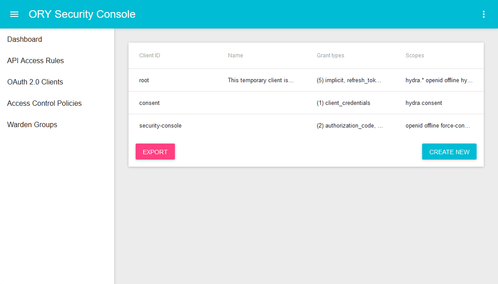

<h1 align="center"></h1>

<h4 align="center">
    <a href="https://discord.gg/PAMQWkr">Chat</a> |
    <a href="https://community.ory.am/">Forums</a> |
    <a href="http://eepurl.com/di390P">Newsletter</a><br/><br/>
    <a href="https://www.ory.sh/docs/next/hydra/">Guide</a> |
    <a href="https://www.ory.sh/docs/next/hydra/sdk/api">API Docs</a> |
    <a href="https://godoc.org/github.com/ory/hydra">Code Docs</a><br/><br/>
    <a href="https://opencollective.com/ory">Support this project!</a>
</h4>

---

ORY Hydra is a hardened, certified OAuth2 and OpenID Connect server optimized for low-latency, high throughput,
and low resource consumption. ORY Hydra *is not* an identity provider (user sign up, user log in, password reset flow),
but connects to your existing identity provider through a [consent app](https://www.ory.sh/docs/next/hydra/oauth2#authenticating-users-and-requesting-consent).
Implementing the consent app in a different language is easy, and exemplary consent apps
([Go](https://github.com/ory/hydra-consent-app-go), [Node](https://github.com/ory/hydra-consent-app-express)) and
[SDKs](https://www.ory.sh/docs/next/hydra/sdk/) are provided.

Besides mitigating various attack vectors, such as database compromisation and OAuth 2.0 weaknesses, ORY Hydra is also
able to securely manage JSON Web Keys.
[Click here](https://www.ory.sh/docs/next/hydra/security-architecture) to read more about security.

<p align="left">
    <a href="https://circleci.com/gh/ory/hydra/tree/master"></a>
    <a href="https://coveralls.io/github/ory/hydra?branch=master"> </a>
    <a href="https://goreportcard.com/report/github.com/ory/hydra"></a>
    <a href="https://bestpractices.coreinfrastructure.org/projects/364"></a>
    <a href="#backers" alt="sponsors on Open Collective"></a> <a href="#sponsors" alt="Sponsors on Open Collective"></a>
</p>

---

<!-- START doctoc generated TOC please keep comment here to allow auto update -->
<!-- DON'T EDIT THIS SECTION, INSTEAD RE-RUN doctoc TO UPDATE -->
**Table of Contents**

- [What is ORY Hydra?](#what-is-ory-hydra)
  - [OAuth2 and OpenID Connect: Open Standards!](#oauth2-and-openid-connect-open-standards)
  - [OpenID Connect Certified](#openid-connect-certified)
- [Quickstart](#quickstart)
  - [5 minutes tutorial: Run your very own OAuth2 environment](#5-minutes-tutorial-run-your-very-own-oauth2-environment)
  - [Installation](#installation)
- [Ecosystem](#ecosystem)
  - [ORY Security Console: Administrative User Interface](#ory-security-console-administrative-user-interface)
  - [ORY Oathkeeper: Identity & Access Proxy](#ory-oathkeeper-identity--access-proxy)
  - [ORY Keto: Access Control Policies as a Server](#ory-keto-access-control-policies-as-a-server)
  - [Examples](#examples)
- [Security](#security)
  - [Disclosing vulnerabilities](#disclosing-vulnerabilities)
- [Benchmarks](#benchmarks)
- [Telemetry](#telemetry)
- [Documentation](#documentation)
  - [Guide](#guide)
  - [HTTP API documentation](#http-api-documentation)
  - [Upgrading and Changelog](#upgrading-and-changelog)
  - [Command line documentation](#command-line-documentation)
  - [Develop](#develop)
- [Libraries and third-party projects](#libraries-and-third-party-projects)
- [Blog posts & articles](#blog-posts--articles)
- [Contributors](#contributors)
- [Backers](#backers)
- [Sponsors](#sponsors)

<!-- END doctoc generated TOC please keep comment here to allow auto update -->

## What is ORY Hydra?

ORY Hydra is a server implementation of the OAuth 2.0 authorization framework and the OpenID Connect Core 1.0. Existing OAuth2
implementations usually ship as libraries or SDKs such as [node-oauth2-server](https://github.com/oauthjs/node-oauth2-server)
or [fosite](https://github.com/ory/fosite/issues), or as fully featured identity solutions with user
management and user interfaces, such as [Dex](https://github.com/coreos/dex).

Implementing and using OAuth2 without understanding the whole specification is challenging and prone to errors, even when
SDKs are being used. The primary goal of ORY Hydra is to make OAuth 2.0 and OpenID Connect 1.0 better accessible.

ORY Hydra implements the flows described in OAuth2 and OpenID Connect 1.0 without forcing you to use a "Hydra User Management"
or some template engine or a predefined front-end. Instead it relies on HTTP redirection and cryptographic methods
to verify user consent allowing you to use ORY Hydra with any authentication endpoint, be it [authboss](https://github.com/go-authboss/authboss), [User Frosting](https://www.userfrosting.com/) or your proprietary Java authentication.

### OAuth2 and OpenID Connect: Open Standards!

ORY Hydra implements Open Standards set by the IETF:

* [The OAuth 2.0 Authorization Framework](https://tools.ietf.org/html/rfc6749)
* [OAuth 2.0 Threat Model and Security Considerations](https://tools.ietf.org/html/rfc6819)
* [OAuth 2.0 Token Revocation](https://tools.ietf.org/html/rfc7009)
* [OAuth 2.0 Token Introspection](https://tools.ietf.org/html/rfc7662)
* [OAuth 2.0 Dynamic Client Registration Protocol](https://tools.ietf.org/html/rfc7591)
* [OAuth 2.0 Dynamic Client Registration Management Protocol](https://tools.ietf.org/html/rfc7592)
* [OAuth 2.0 for Native Apps](https://tools.ietf.org/html/draft-ietf-oauth-native-apps-10)
* [Proof Key for Code Exchange by OAuth Public Clients](https://tools.ietf.org/html/rfc7636)

and the OpenID Foundation:

* [OpenID Connect Core 1.0](http://openid.net/specs/openid-connect-core-1_0.html)
* [OpenID Connect Discovery 1.0](https://openid.net/specs/openid-connect-discovery-1_0.html)
* [OpenID Connect Dynamic Client Registration 1.0](https://openid.net/specs/openid-connect-registration-1_0.html)
* [OpenID Connect Front-Channel Logout 1.0](https://openid.net/specs/openid-connect-frontchannel-1_0.html)
* [OpenID Connect Back-Channel Logout 1.0](https://openid.net/specs/openid-connect-backchannel-1_0.html)

### OpenID Connect Certified

ORY Hydra is an OpenID Foundation [certified OpenID Provider (OP)](http://openid.net/certification/#OPs).

<p align="center">
    
</p>

The following OpenID profiles are certified:

* [Basic OpenID Provider](http://openid.net/specs/openid-connect-core-1_0.html#CodeFlowAuth) (response types `code`)
* [Implicit OpenID Provider](http://openid.net/specs/openid-connect-core-1_0.html#ImplicitFlowAuth) (response types `id_token`, `id_token+token`)
* [Hybrid OpenID Provider](http://openid.net/specs/openid-connect-core-1_0.html#HybridFlowAuth) (response types `code+id_token`, `code+id_token+token`, `code+token`)
* [OpenID Provider Publishing Configuration Information](https://openid.net/specs/openid-connect-discovery-1_0.html)
* [Dynamic OpenID Provider](https://openid.net/specs/openid-connect-registration-1_0.html)

To obtain certification, we deployed the [reference user login and consent app](https://github.com/ory/hydra-login-consent-node)
(unmodified) and ORY Hydra v1.0.0.

## Quickstart

This section is a quickstart guide to working with ORY Hydra. In-depth docs are available as well:

* The documentation is available [here](https://www.ory.sh/docs/next/hydra).
* The REST API documentation is available [here](https://www.ory.sh/docs/next/hydra/sdk/api).

### 5 minutes tutorial: Run your very own OAuth2 environment

The **[tutorial](https://www.ory.sh/docs/next/hydra/5min-tutorial)** teaches you to set up ORY Hydra,
a Postgres instance and an exemplary identity provider written in React using docker compose.
It will take you about 5 minutes to complete the **[tutorial](https://www.ory.sh/docs/next/hydra/5min-tutorial)**.


<br clear="all">

### Installation

Head over to the [ORY Developer Documentation](https://www.ory.sh/docs/next/hydra/configure-deploy#installing-ory-hydra) to learn how to install ORY Hydra on Linux, macOS, Windows, and Docker and how to build ORY Hydra from source.

## Ecosystem

<a href="https://console.ory.sh/">
    
</a>

### ORY Security Console: Administrative User Interface

The [ORY Security Console](https://console.ory.sh/) is a visual admin interface for managing ORY Hydra,
ORY Oathkeeper, and ORY Keto.

### ORY Oathkeeper: Identity & Access Proxy

[ORY Oathkeeper](https://github.com/ory/oathkeeper) is a BeyondCorp/Zero Trust Identity & Access Proxy (IAP) built
on top of OAuth2 and ORY Hydra.

### ORY Keto: Access Control Policies as a Server

[ORY Keto](https://github.com/ory/keto) is a policy decision point. It uses a set of access control policies, similar
to AWS IAM Policies, in order to determine whether a subject (user, application, service, car, ...) is authorized to
perform a certain action on a resource.

### Examples

The [ory/examples](https://github.com/ory/examples) repository contains numerous examples of setting up this project
individually and together with other services from the ORY Ecosystem.

## Security

*Why should I use ORY Hydra? It's not that hard to implement two OAuth2 endpoints and there are numerous SDKs out there!*

OAuth2 and OAuth2 related specifications are over 400 written pages. Implementing OAuth2 is easy, getting it right is hard.
ORY Hydra is trusted by companies all around the world, has a vibrant community and faces millions of requests in production
each day. Of course, we also compiled a security guide with more details on cryptography and security concepts.
Read [the security guide now](https://www.ory.sh/docs/next/hydra/security-architecture).

### Disclosing vulnerabilities

If you think you found a security vulnerability, please refrain from posting it publicly on the forums, the chat, or GitHub
and send us an email to [hi@ory.am](mailto:hi@ory.sh) instead.

## Benchmarks

Our continuous integration runs a collection of benchmarks against ORY Hydra. You can find the results [here](https://www.ory.sh/docs/next/performance/hydra).

## Telemetry

Our services collect summarized, anonymized data which can optionally be turned off. Click
[here](https://www.ory.sh/docs/next/ecosystem/sqa) to learn more.

## Documentation

### Guide

The Guide is available [here](https://www.ory.sh/docs/next/hydra).

### HTTP API documentation

The HTTP API is documented [here](https://www.ory.sh/docs/next/hydra/sdk/api).

### Upgrading and Changelog

New releases might introduce breaking changes. To help you identify and incorporate those changes, we document these
changes in [UPGRADE.md](./UPGRADE.md) and [CHANGELOG.md](./CHANGELOG.md).

### Command line documentation

Run `hydra -h` or `hydra help`.

### Develop

Developing with ORY Hydra is as easy as:

```
go get -d -u github.com/ory/hydra
cd $GOPATH/src/github.com/ory/hydra
make init
export GO111MODULE=on
## With database
make test
## Without database
make test-short
```

Then run it with in-memory database:

```
DSN=memory go run main.go serve all
```

**Notes**

* We changed organization name from `ory-am` to `ory`. In order to keep backwards compatibility, we did not rename Go packages.
* You can ignore warnings similar to `package github.com/ory/hydra/cmd/server: case-insensitive import collision: "github.com/sirupsen/logrus" and "github.com/sirupsen/logrus"`.

## Libraries and third-party projects

Official:
* [User Login & Consent Example](https://github.com/ory/hydra-login-consent-node)

Community:
* [Consent App SDK for Go](https://github.com/janekolszak/idp)
* [ORY Hydra middleware for Gin](https://github.com/janekolszak/gin-hydra)
* [Kubernetes helm chart](https://github.com/kubernetes/charts/pull/1022)
* [Werther - an Identity Provider over LDAP](https://github.com/i-core/werther)

## Blog posts & articles

* [Creating an oauth2 custom lamda authorizer for use with Amazons (AWS) API Gateway using Hydra](https://blogs.edwardwilde.com/2017/01/12/creating-an-oauth2-custom-lamda-authorizer-for-use-with-amazons-aws-api-gateway-using-hydra/)
* Warning, ORY Hydra has changed almost everything since writing this
article: [Hydra: Run your own Identity and Access Management service in <5 Minutes](https://blog.gopheracademy.com/advent-2015/hydra-auth/)

## Contributors

This project exists thanks to all the people who contribute. [[Contribute](CONTRIBUTING.md)].
<a href="https://github.com/ory/hydra/graphs/contributors"></a>

## Backers

Thank you to all our backers! 🙏 [[Become a backer](https://opencollective.com/ory#backer)]

<a href="https://opencollective.com/ory#backers" target="_blank"></a>
We would also like to thank (past & current) supporters (in alphabetical order) on [Patreon](https://www.patreon.com/_ory): Alexander Alimovs, Billy, Chancy Kennedy, Drozzy, Edwin Trejos, Howard Edidin, Ken Adler Oz Haven, Stefan Hans, TheCrealm


## Sponsors

Support this project by becoming a sponsor. Your logo will show up here with a link to your website. [[Become a sponsor](https://opencollective.com/ory#sponsor)]

<a href="https://opencollective.com/ory/sponsor/0/website" target="_blank"></a>
<a href="https://opencollective.com/ory/sponsor/1/website" target="_blank"></a>
<a href="https://opencollective.com/ory/sponsor/2/website" target="_blank"></a>
<a href="https://opencollective.com/ory/sponsor/3/website" target="_blank"></a>
<a href="https://opencollective.com/ory/sponsor/4/website" target="_blank"></a>
<a href="https://opencollective.com/ory/sponsor/5/website" target="_blank"></a>
<a href="https://opencollective.com/ory/sponsor/6/website" target="_blank"></a>
<a href="https://opencollective.com/ory/sponsor/7/website" target="_blank"></a>
<a href="https://opencollective.com/ory/sponsor/8/website" target="_blank"></a>
<a href="https://opencollective.com/ory/sponsor/9/website" target="_blank"></a>

A special thanks goes out to **Wayne Robinson** for supporting this ecosystem with $200 every month since October 2016 [on Patreon](https://www.patreon.com/_ory).
