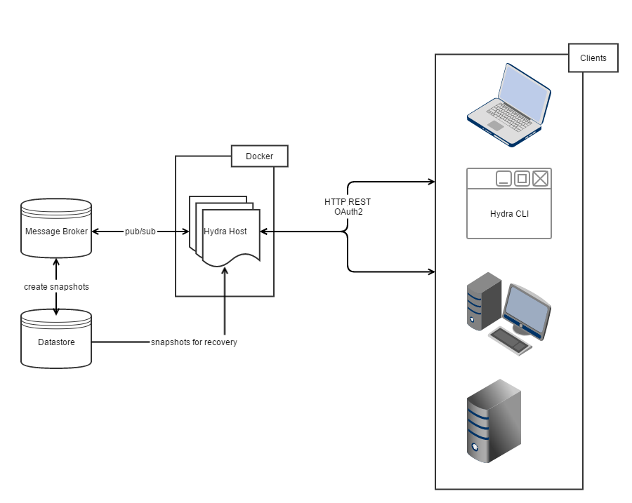

## Architecture

Hydra uses pub/sub to have the latest data always available in memory. RethinkDB makes it possible to recover from
failures and synchronize the cluster when something changes. Data is kept in memory for best performance results.
The storage layer is abstracted and can be modified to use RabbitMQ or MySQL amongst others.

The message broker keeps the data between all host process in synch. This results in effortless `hydra host`
scaling on every platform you can imagine: Heroku, Cloud Foundry, Docker, Google Container Engine and many more.

Serving a uniform API reduces security risks. This is why all clients use REST and OAuth2 HTTP APIs.
The Command Line Interface (CLI) `hydra`, responsible for managing the cluster, uses these as well.
