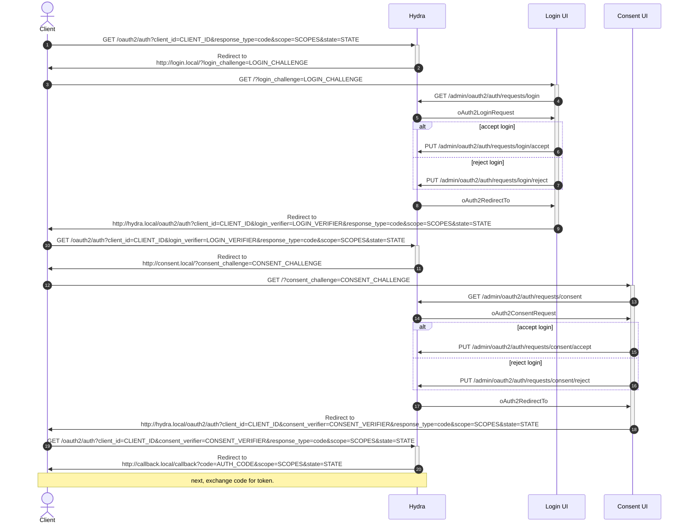

# Flow Cache Design Doc

## Overview

This design doc outlines the proposed solution for caching the flow object in
the OAuth2 exchange between the Client, Ory Hydra, and the Consent and Login
UIs. The flow object contains the state of the authorization request.

## Problem Statement

Currently, the flow object is stored in the database on the Ory Hydra server.
This approach has several drawbacks:

- Each step of the OAuth2 flow (initialization, consent, login, etc.) requires a
  database query to retrieve the flow object, and another to update it.
- Each part of the exchanges supplies different values (login challenge, consent
  challenge, etc.) to identify the flow object. This means the database table
  has multiple indices that slow down insertions.

## Proposed Solution

The proposed solution is to store the flow object in client cookies and URLs.
This way, the flow object is written only once when the flow is completed and
the final authorization code is generated.

### Requirements

- The flow object must be stored in client cookies and URLs.
- The flow object must be secure and protect against unauthorized access.
- The flow object must be persistent, so that the flow can be resumed if the
  user navigates away from the page or closes the browser.
- The flow object must be scalable and able to handle a large number of
  concurrent requests.

### Architecture

The proposed architecture for the flow cache is as follows:

- Store the flow object in an AEAD encrypted cookie.
- Pass a partial flow around in the URL.
- Use a secure connection to protect against unauthorized access.



Step 2:

- Set the whole flow as an AEAD encrypted cookie on the client
- The cookie is keyed by the `state`, so that multiple flows can run in parallel
  from one cookie jar
- Set the `LOGIN_CHALLENGE` to the AEAD-encrypted `oAuth2LoginRequest` for the
  flow
- Write a hash of the `LOGIN_CHALLENGE` to the database into a `single_uses`
  table.

Step 5:

- Decrypt the `oAuth2LoginRequest` from the `LOGIN_CHALLENGE`

Step 8:

- Encode into the redirect URL in `oAuth2RedirectTo` as the `LOGIN_VERIFIER` the
  flow id and accept or reject payload

```protobuf
message AcceptLoginRequest {
  // A hash of the login challenge this message accepts.
  string login_challenge_hash = 1;

  // Remember, if set to true, tells ORY Hydra to remember this user by telling the user agent (browser) to store
  // a cookie with authentication data. If the same user performs another OAuth 2.0 Authorization Request, he/she
  // will not be asked to log in again.
  bool remember = 2 [(json_name) = "remember"];

  // RememberFor sets how long the authentication should be remembered for in seconds. If set to `0`, the
  // authorization will be remembered for the duration of the browser session (using a session cookie).
  int32 remember_for = 3 [(json_name) = "remember_for"];

  // Extend OAuth2 authentication session lifespan
  //
  // If set to `true`, the OAuth2 authentication cookie lifespan is extended. This is for example useful if you want the user to be able to use `prompt=none` continuously.
  //
  // This value can only be set to `true` if the user has an authentication, which is the case if the `skip` value is `true`.
  //
  // required: false
  bool extend_session_lifespan = 4 [(json_name) = "extend_session_lifespan"];

  // ACR sets the Authentication AuthorizationContext Class Reference value for this authentication session. You can use it
  // to express that, for example, a user authenticated using two factor authentication.
  string acr = 5 [(json_name) = "acr"];

  // AMR sets the Authentication Methods References value for this
  // authentication session. You can use it to specify the method a user used to
  // authenticate. For example, if the acr indicates a user used two factor
  // authentication, the amr can express they used a software-secured key.
  repeated string amr = 6 [(json_name) = "amr"];

  // Subject is the user ID of the end-user that authenticated.
  //
  // required: true
  string subject = 7 [(json_name) = "subject"];

  // ForceSubjectIdentifier forces the "pairwise" user ID of the end-user that authenticated. The "pairwise" user ID refers to the
  // (Pairwise Identifier Algorithm)[http://openid.net/specs/openid-connect-core-1_0.html#PairwiseAlg] of the OpenID
  // Connect specification. It allows you to set an obfuscated subject ("user") identifier that is unique to the client.
  //
  // Please note that this changes the user ID on endpoint /userinfo and sub claim of the ID Token. It does not change the
  // sub claim in the OAuth 2.0 Introspection.
  //
  // Per default, ORY Hydra handles this value with its own algorithm. In case you want to set this yourself
  // you can use this field. Please note that setting this field has no effect if `pairwise` is not configured in
  // ORY Hydra or the OAuth 2.0 Client does not expect a pairwise identifier (set via `subject_type` key in the client's
  // configuration).
  //
  // Please also be aware that ORY Hydra is unable to properly compute this value during authentication. This implies
  // that you have to compute this value on every authentication process (probably depending on the client ID or some
  // other unique value).
  //
  // If you fail to compute the proper value, then authentication processes which have id_token_hint set might fail.
  string force_subject_identifier = 8 [(json_name) = "force_subject_identifier"];

  // Context is an optional object which can hold arbitrary data. The data will be made available when fetching the
  // consent request under the "context" field. This is useful in scenarios where login and consent endpoints share
  // data.
  string context = 9 [(json_name) = "context"];

  // If set to true means that the request was already handled. This
  // can happen on form double-submit or other errors. If this is set
  // we recommend redirecting the user to `request_url` to re-initiate
  // the flow.
  //
  // json_name: "-"
  bool was_handled = 10 [(json_name) = "-"];

  // LoginRequest is the login request associated with this handled login request.
  //
  // json_name: "-"
  LoginRequest login_request = 11 [(json_name) = "-"];

  // Error is the error associated with this handled login request.
  //
  // json_name: "-"
  RequestDeniedError error = 12 [(json_name) = "-"];

  // RequestedAt is the time when the login request was made.
  //
  // json_name: "-"
  google.protobuf.Timestamp requested_at = 13 [(json_name) = "-"];

  // AuthenticatedAt is the time when the user was authenticated.
  //
  // json_name: "-"
  google.protobuf.Timestamp authenticated_at = 14 [(json_name) = "-"];
}

message RequestDeniedError {
  // A hash of the consent challenge this rejects.
  string consent_challenge_hash = 6;

  // The error should follow the OAuth2 error format (e.g. `invalid_request`, `login_required`).
  //
  // Defaults to `request_denied`.
  string error = 1 [(json_name) = "error"];

  // Debug contains information to help resolve the problem as a developer. Usually not exposed
  // to the public but only in the server logs.
  string error_debug = 5 [(json_name) = "error_debug"];

  // Description of the error in a human readable format.
  string error_description = 2 [(json_name) = "error_description"];

  // Hint to help resolve the error.
  string error_hint = 3 [(json_name) = "error_hint"];

  // Represents the HTTP status code of the error (e.g. 401 or 403)
  //
  // Defaults to 400
  int32 status_code = 4 [(json_name) = "status_code"];
}
```

Step 11

- Check that the login challenge in the `LOGIN_VERIFIER` matches the challenge
  in the flow cookie.
- Assert that the hash of the `LOGIN_CHALLENGE` is present in the `single_uses`
  table and delete it in a transaction scoped to the current HTTP request.
- Update the flow based on the request from the `LOGIN_VERIFIER`
- Update the cookie
- Set the `CONSENT_CHALLENGE` to the AEAD-encrypted `oAuth2ConsentRequest` for
  the flow
- Write a hash of the `CONSENT_CHALLENGE` to the database into a `single_uses`
  table.

Step 14:

- Decrypt the `oAuth2ConsentRequest` from the `CONSENT_CHALLENGE`

Step 17:

- Encode into the redirect URL in `oAuth2RedirectTo` as the `CONSENT_VERIFIER`
  the flow id and the accept or reject payload

```protobuf
message AcceptOAuth2ConsentRequest {
  // A hash of the consent challenge this accepts.
  string consent_challenge_hash = 1;

  repeated string granted_access_token_audience = 3;
  repeated string granted_scope = 2;
  google.protobuf.Timestamp handled_at = 6;
  bool remember = 4;
  int32 remember_for = 5;

  message Session {
    map<string, google.protobuf.Value> access_token = 1;
    map<string, google.protobuf.Value> id_token = 2;
  }
  AcceptOAuth2ConsentRequestSession session = 6;
}

// Reject: RequestDeniedError see above.
```

Step 20

- Check that the consent challenge in the `CONSENT_VERIFIER` matches the
  challenge in the flow cookie.
- Assert that the hash of the `CONSENT_CHALLENGE` is present in the
  `single_uses` table and delete it in a transaction scoped to the current HTTP
  request.
- Update the flow based on the request from the `CONSENT_VERIFIER`
- Update the cookie
- Write the flow to the database
- Continue the flow as currently implemented (generate the authentication code,
  return the code, etc.)

### Client HTTP requests

For reference, these HTTP requests are issued by the client:

```
GET http://hydra.local/oauth2/auth?client_id=CLIENT_ID&nonce=NONCE&response_type=code&scope=SCOPES&state=STATE
Redirect to http://login.local/?login_challenge=LOGIN_CHALLENGE
GET http://login.local/?login_challenge=LOGIN_CHALLENGE
Redirect to http://hydra.local/oauth2/auth?client_id=CLIENT_ID&login_verifier=LOGIN_VERIFIER&nonce=NONCE&response_type=code&scope=SCOPES&state=STATE
GET http://hydra.local/oauth2/auth?client_id=CLIENT_ID&login_verifier=LOGIN_VERIFIER&nonce=NONCE&response_type=code&scope=SCOPES&state=STATE
Redirect to http://consent.local/?consent_challenge=CONSENT_CHALLENGE
GET http://consent.local/?consent_challenge=CONSENT_CHALLENGE
Redirect to http://hydra.local/oauth2/auth?client_id=CLIENT_ID&consent_verifier=CONSENT_VERIFIER&nonce=NONCE&response_type=code&scope=SCOPES&state=STATE
GET http://hydra.local/oauth2/auth?client_id=CLIENT_ID&consent_verifier=CONSENT_VERIFIER&nonce=NONCE&response_type=code&scope=SCOPES&state=STATE
Redirect to http://callback.local/callback?code=AUTH_CODE&scope=SCOPES&state=STATE
GET http://callback.local/callback?code=AUTH_CODE&scope=SCOPES&state=STATE
```

### Implementation

The implementation of the flow cache will involve the following steps:

1. Modify the Ory Hydra server to store the flow object in an AEAD encrypted
   cookie.
2. Modify the Consent and Login UIs to include the flow object in the URL.
3. Use HTTPS to protect against unauthorized access.

## Conclusion

The proposed solution for caching the flow object in the OAuth2 exchange between
the Client, Ory Hydra, and the Consent and Login UIs is to store the flow object
in client cookies and URLs. This approach eliminates the need for a distributed
cache and provides a scalable and secure solution. The flow object will be
stored in an AEAD encrypted cookie and passed around in the URL. HTTPS will be
used to protect against unauthorized access.
