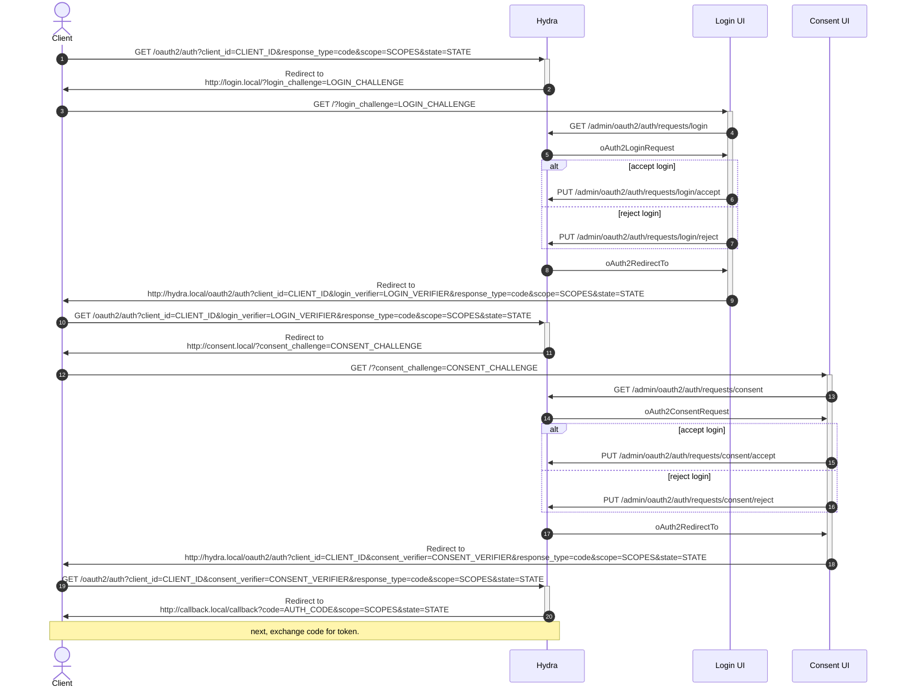

# Flow Cache Design Doc

## Overview

This design doc outlines the proposed solution for caching the flow object in
the OAuth2 exchange between the Client, Ory Hydra, and the Consent and Login
UIs. The flow object contains the state of the authorization request.

## Problem Statement

Currently, the flow object is stored in the database on the Ory Hydra server.
This approach has several drawbacks:

- Each step of the OAuth2 flow (initialization, consent, login, etc.) requires a
  database query to retrieve the flow object, and another to update it.
- Each part of the exchanges supplies different values (login challenge, consent
  challenge, etc.) to identify the flow object. This means the database table
  has multiple indices that slow down insertions.

## Proposed Solution

The proposed solution is to store the flow object in client cookies and URLs.
This way, the flow object is written only once when the flow is completed and
the final authorization code is generated.

### Requirements

- The flow object must be stored in client cookies and URLs.
- The flow object must be secure and protect against unauthorized access.
- The flow object must be persistent, so that the flow can be resumed if the
  user navigates away from the page or closes the browser.
- The flow object must be scalable and able to handle a large number of
  concurrent requests.

### Architecture

The proposed architecture for the flow cache is as follows:

- Store the flow object in an AEAD encrypted cookie.
- Pass a partial flow around in the URL.
- Use a secure connection to protect against unauthorized access.



Step 2:

- Set the whole flow as an AEAD encrypted cookie on the client
- The cookie is keyed by the `state`, so that multiple flows can run in parallel
  from one cookie jar
- Set the `LOGIN_CHALLENGE` to the AEAD-encrypted flow

Step 5:

- Decrypt the flow from the `LOGIN_CHALLENGE`, return the `oAuth2LoginRequest`

Step 8:

- Encode the flow into the redirect URL in `oAuth2RedirectTo` as the
  `LOGIN_VERIFIER`

Step 11

- Check that the login challenge in the `LOGIN_VERIFIER` matches the challenge
  in the flow cookie.
- Update the flow based on the request from the `LOGIN_VERIFIER`
- Update the cookie
- Set the `CONSENT_CHALLENGE` to the AEAD-encrypted flow

Step 14:

- Decrypt the flow from the `CONSENT_CHALLENGE`

Step 17:

- Encode the flow into the redirect URL in `oAuth2RedirectTo` as the
  `CONSENT_VERIFIER`

Step 20

- Check that the consent challenge in the `CONSENT_VERIFIER` matches the
  challenge in the flow cookie.
- Update the flow based on the request from the `CONSENT_VERIFIER`
- Update the cookie
- Write the flow to the database
- Continue the flow as currently implemented (generate the authentication code,
  return the code, etc.)

### Client HTTP requests

For reference, these HTTP requests are issued by the client:

```
GET http://hydra.local/oauth2/auth?client_id=CLIENT_ID&nonce=NONCE&response_type=code&scope=SCOPES&state=STATE
Redirect to http://login.local/?login_challenge=LOGIN_CHALLENGE
GET http://login.local/?login_challenge=LOGIN_CHALLENGE
Redirect to http://hydra.local/oauth2/auth?client_id=CLIENT_ID&login_verifier=LOGIN_VERIFIER&nonce=NONCE&response_type=code&scope=SCOPES&state=STATE
GET http://hydra.local/oauth2/auth?client_id=CLIENT_ID&login_verifier=LOGIN_VERIFIER&nonce=NONCE&response_type=code&scope=SCOPES&state=STATE
Redirect to http://consent.local/?consent_challenge=CONSENT_CHALLENGE
GET http://consent.local/?consent_challenge=CONSENT_CHALLENGE
Redirect to http://hydra.local/oauth2/auth?client_id=CLIENT_ID&consent_verifier=CONSENT_VERIFIER&nonce=NONCE&response_type=code&scope=SCOPES&state=STATE
GET http://hydra.local/oauth2/auth?client_id=CLIENT_ID&consent_verifier=CONSENT_VERIFIER&nonce=NONCE&response_type=code&scope=SCOPES&state=STATE
Redirect to http://callback.local/callback?code=AUTH_CODE&scope=SCOPES&state=STATE
GET http://callback.local/callback?code=AUTH_CODE&scope=SCOPES&state=STATE
```

### Implementation

The implementation of the flow cache will involve the following steps:

1. Modify the Ory Hydra server to store the flow object in an AEAD encrypted
   cookie.
2. Modify the Consent and Login UIs to include the flow object in the URL.
3. Use HTTPS to protect against unauthorized access.

## Conclusion

The proposed solution for caching the flow object in the OAuth2 exchange between
the Client, Ory Hydra, and the Consent and Login UIs is to store the flow object
in client cookies and URLs. This approach eliminates the need for a distributed
cache and provides a scalable and secure solution. The flow object will be
stored in an AEAD encrypted cookie and passed around in the URL. HTTPS will be
used to protect against unauthorized access.
