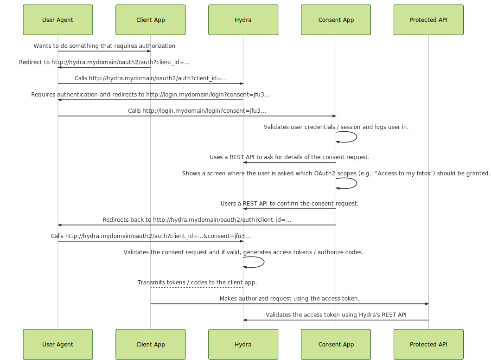

# OAuth 2.0 & OpenID Connect

If you are new to OAuth2, please read the [Introduction to OAuth 2.0 and OpenID Connect](README.md#introduction-to-oauth-20-and-openid-connect)
first.

## Overview

This section defines a glossary, provides additional information on OpenID Connect and introduces OAuth 2.0 Clients.

### Glossary

1. **The resource owner** is the user who authorizes an application to access their account. The application's access to
the user's account is limited to the "scope" of the authorization granted (e.g. read or write access).
2. **Authorization Server (Hydra)** verifies the identity of the user and issues access tokens to the *client application*.
3. **Client** is the *application* that wants to access the user's account. Before it may do so, it must be authorized
by the user.
4. **Identity Provider** contains a login user interface and a database of all your users. To integrate Hydra,
you must modify the Identity Provider. It mus be able to generate consent tokens and ask for the user's consent.
5. **User Agent** is usually the resource owner's browser.
6. **Consent App** is an app (e.g. NodeJS) that is able to receive consent challenges and create consent tokens.
It must verify the identity of the user that is giving the consent. This can be achieved using Cookie Auth,
HTTP Basic Auth, Login HTML Form, or any other mean of authentication. Upon authentication, the user must be asked
if he consents to allowing the client access to his resources.

Examples:
1. Peter wants to give MyPhotoBook access to his Dropbox. Peter is the resource owner.
2. The Authorization Server (Hydra) is responsible for managing the access request for MyPhotoBook. Hydra handles
the communication between the resource owner, the consent endpoint and the client. Hydra is the authorization server.
In this case, Dropbox would be the one who uses Hydra.
3. MyPhotoBook is the client and was issued an id and a password by Hydra. MyPhotoBook uses these credentials
to talk with Hydra.
4. Dropbox has a database and a frontend that allow their users to login, using their username and password.
This is what an Identity Provider does.
5. The User Agent is Peter's FireFox.
6. The Consent App is a frontend app that asks the user if he is willing to give MyPhotoBook access to his pictures stored
on Dropbox. It is responsible to tell Hydra if the user accepted or rejected the request by MyPhotoBook. The Consent App
uses the Identity Provider to authenticate peter, for example by using cookies or presenting a user/password login view.

### OpenID Connect 1.0

If you are new to OpenID Connect, please read the [Introduction to OAuth 2.0 and OpenID Connect](README.md#introduction-to-oauth-20-and-openid-connect)
first. 

Hydra uses the [JSON Web Key Manager](./jwk.md) to retrieve the
key pair `hydra.openid.id-token` for signing ID tokens. You can use that endpoint to retrieve the public key for verification.
Additionally, Hydra supports OpenID Connect Discovery.

### OAuth 2.0 Clients

You can manage *OAuth 2.0 clients* using the cli or the HTTP REST API.

* **CLI:** `hydra clients -h`
* **REST:** Read the [API Docs](http://docs.hydra13.apiary.io/#reference/oauth2-clients)

## Consent Flow

The consent flow is a HTTP redirect flow responsible for authenticating users.

ORY Hydra does not include user authentication itself and things like lost password, user registration or user activation
(commonly known as "Login Service", "User Management" or "Identity Management") are not supported by ORY Hydra.

To connect to your user management solution, you need to implement the consent flow. The app or service implementing the
consent flow is called consent app. The consent app does not have to be its own service, you can modify your existing
login service ("user management") and implement the consent flow with it.

### Flow Overview

Let us look at the sequence of requests being made to successfully perform an OAuth 2.0 authorize code flow using ORY Hydra:

The state machine of the consent app itself typically looks as followed.

<!--
graph TD
H{Hydra} -->|Redirects to consent app with consent request ID| C{Consent App}
C -->|Initiates Consent Flow| CA(Is the user signed in already?)
CA -->|yes| CG(Fetch consent request from Hydra using REST API)
CA -->|no| CL(Sign user in using login form)
CL -->|Sign in failed| CL
CL -->|Sign in successful| CG
CG-->CC(Ask user to authorize requested scopes)
CC -->|User denies authorization| CHD(Tell Hydra to deny the consent request using REST API)
CC -->|User accepts authorization| CHA(Tell Hydra to accept the consent request with the granted scopes using REST API)
CHD-->CHR(Read redirectUrl value from consent request payload)
CHA-->CHR
CHR-->|Redirect to redirectUrl value|H2{Hydra}
-->

**Legend:**

* User Agent: The "user agent" the user is using to access an app
that requires OAuth2 tokens to make calls to a protected API
or that requires OpenID Connect tokens. Typically, this is a browser
or a mobile app.
* Client App: This could be a server side app,
a single page app (web app), or a mobile app. In the case
of a mobile app, the user agent is also the client app.
* Hydra: Well, that's Hydra of course.
* Consent App: The app implementing the consent flow.
* Protected API: An API that requires valid access tokens for authorization.
* Consent Request ID: `?consent=jfu3...` is the consent request ID. You need to use this request ID to
fetch infromation on the authroization request and to accept or reject the
consent request.

#### Exemplary Consent App UI

Here is how Google chose to design the login and consent UI (what we call the "consent app"):

### Consent REST API

There are three API endpoints available for managing consent request:

* [Fetch information on a consent request](http://docs.hydra13.apiary.io/#reference/oauth2/oauth2consentrequestsid)
* [Accept a consent request](http://docs.hydra13.apiary.io/#reference/oauth2/oauth2consentrequestsidaccept)
* [Reject a consent request](http://docs.hydra13.apiary.io/#reference/oauth2/oauth2consentrequestsidreject)

### Error Handling during Consent App Flow

Hydra follows the OAuth 2.0 error response specifications. Some errors however must be handled by the consent app.
In the case of such an error, the user agent will be redirected to the consent app
endpoint and an `error` and `error_description` query parameter will be appended to the URL.

## OAuth2 Token Introspection

OAuth2 Token Introspection is an [IETF](https://tools.ietf.org/html/rfc7662) standard.
It defines a method for a protected resource to query
an OAuth 2.0 authorization server to determine the active state of an
OAuth 2.0 token and to determine meta-information about this token.
OAuth 2.0 deployments can use this method to convey information about
the authorization context of the token from the authorization server
to the protected resource.

The Token Introspection endpoint is documented in the
[API Docs](http://docs.hydra13.apiary.io/#reference/oauth2/oauth2-token-introspection).

## OAuth2 Scopes

Hydra has the following pre-defined scopes:

* `offline`: Include this scope if you wish to receive a refresh token
* `openid`: Include this scope if you wish to perform an OpenID Connect request.

To manage ORY Hydra, various scopes are required. A complete list is available [here](http://docs.hydra13.apiary.io/#authentication/oauth2).

Please be aware that any OAuth2 client requesting a set of scopes must also be allowed to request said scopes. You can define
the allowed scopes using the OAuth2 client REST API.

### Scope strategy

ORY Hydra matches scopes with wildcards:

* `foo` matches `foo` but not `foo.bar`
* `foo.*` matches `foo.bar`, `foo.baz`, `foo.bar.baz` but not `foo`
* `foo.*.bar` matches `foo.bar.bar`, `foo.baz.bar` but not `foo.baz.baz.bar`
* `foo*` matches `foo*` but not `foobar`

To grant an OAuth2 client full management capabilities in hydra, add `hydra.*` to the allowed scopes. To grant an OAuth2
client any scopes, simply add `*`.
