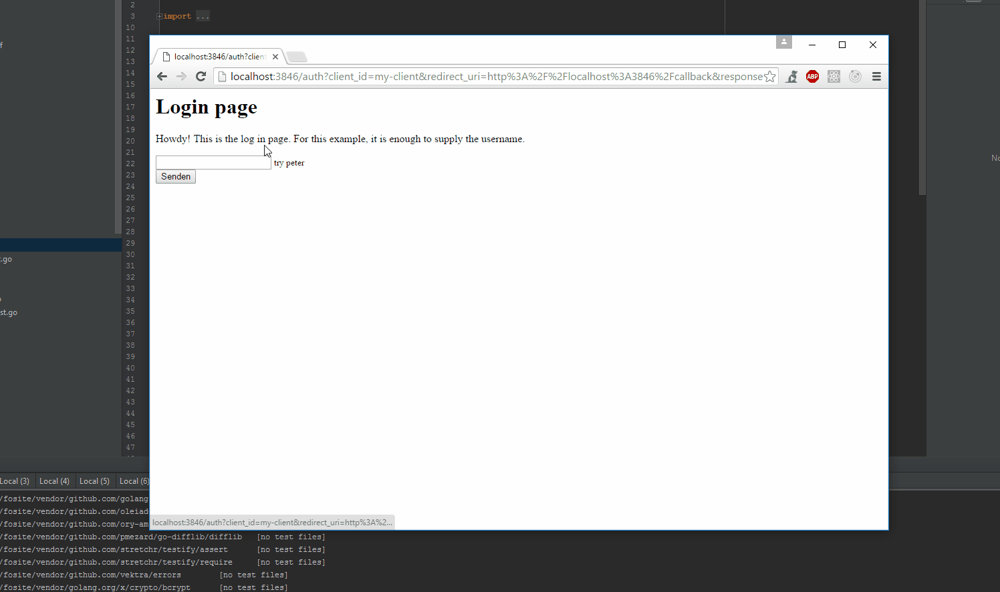

<h1 align="center"></h1>

[](https://travis-ci.org/ory/fosite?branch=master)
[](https://coveralls.io/github/ory/fosite?branch=master)
[](https://goreportcard.com/report/ory/fosite)

[](https://www.ory.sh/chat)

**The security first OAuth2 & OpenID Connect framework for
[Go](https://golang.org).** Built simple, powerful and extensible. This library
implements peer-reviewed [IETF RFC6749](https://tools.ietf.org/html/rfc6749),
counterfeits weaknesses covered in peer-reviewed
[IETF RFC6819](https://tools.ietf.org/html/rfc6819) and countermeasures various
database attack scenarios, keeping your application safe when that hacker
penetrates or leaks your database. OpenID Connect is implemented according to
[OpenID Connect Core 1.0 incorporating errata set 1](https://openid.net/specs/openid-connect-core-1_0.html)
and includes all flows: code, implicit, hybrid.

This library considered and implemented:

- [The OAuth 2.0 Authorization Framework](https://tools.ietf.org/html/rfc6749)
- [OAuth 2.0 Multiple Response Type Encoding Practices](https://openid.net/specs/oauth-v2-multiple-response-types-1_0.html)
- [OAuth 2.0 Threat Model and Security Considerations](https://tools.ietf.org/html/rfc6819)
- [Proof Key for Code Exchange by OAuth Public Clients](https://tools.ietf.org/html/rfc7636)
- [OAuth 2.0 for Native Apps](https://tools.ietf.org/html/rfc8252)
- [OpenID Connect Core 1.0](https://openid.net/specs/openid-connect-core-1_0.html)
- [OAuth 2.0 Pushed Authorization Request](https://datatracker.ietf.org/doc/html/rfc9126)

OAuth2 and OpenID Connect are difficult protocols. If you want quick wins, we
strongly encourage you to look at [Hydra](https://github.com/ory-am/hydra).
Hydra is a secure, high performance, cloud native OAuth2 and OpenID Connect
service that integrates with every authentication method imaginable and is built
on top of Fosite.

<!-- START doctoc generated TOC please keep comment here to allow auto update -->
<!-- DON'T EDIT THIS SECTION, INSTEAD RE-RUN doctoc TO UPDATE -->

**Table of Contents**

- [Motivation](#motivation)
- [API Stability](#api-stability)
- [Example](#example)
- [A word on quality](#a-word-on-quality)
- [A word on security](#a-word-on-security)
- [A word on extensibility](#a-word-on-extensibility)
- [Installation](#installation)
- [Documentation](#documentation)
  - [Scopes](#scopes)
    - [`fosite.WildcardScopeStrategy`](#fositewildcardscopestrategy)
    - [`fosite.HierarchicScopeStrategy`](#fositehierarchicscopestrategy)
  - [Quickstart](#quickstart)
  - [Code Examples](#code-examples)
  - [Example Storage Implementation](#example-storage-implementation)
  - [Extensible handlers](#extensible-handlers)
  - [JWT Introspection](#jwt-introspection)
- [Contribute](#contribute)
  - [Refresh mock objects](#refresh-mock-objects)
- [Hall of Fame](#hall-of-fame)

<!-- END doctoc generated TOC please keep comment here to allow auto update -->

## Motivation

Fosite was written because our OAuth2 and OpenID Connect service
[**Hydra**](https://github.com/ory-am/hydra) required a secure and extensible
OAuth2 library. We had to realize that nothing matching our requirements was out
there, so we decided to build it ourselves.

## API Stability

The core public API is almost stable as most changes will only touch the inner
workings.

We strongly encourage vendoring fosite using
[dep](https://github.com/golang/dep) or comparable tools.

## Example

The example does not have nice visuals but it should give you an idea of what
you can do with Fosite and a few lines of code.



You can run this minimalistic example by doing

```
go get github.com/ory/fosite-example
cd $GOPATH/src/github.com/ory/fosite-example
dep ensure
go install github.com/ory/fosite-example
fosite-example
```

There should be a server listening on [localhost:3846](https://localhost:3846/).
You can check out the example's source code
[here](https://github.com/ory/fosite-example/).

## A word on quality

We tried to set up as many tests as possible and test for as many cases covered
in the RFCs as possible. But we are only human. Please, feel free to add tests
for the various cases defined in the OAuth2 RFCs 6749 and 6819 or any other
cases that improve the tests.

**Everyone** writing an RFC conform test that breaks with the current
implementation, will receive a place in the [Hall of Fame](#hall-of-fame)!

## A word on security

Please be aware that Fosite only secures parts of your server side security. You
still need to secure your apps and clients, keep your tokens safe, prevent CSRF
attacks, ensure database security, use valid and strong TLS certificates and
much more. If you need any help or advice feel free to contact our security
staff through [our website](https://ory.am/)!

We have given the various specifications, especially
[OAuth 2.0 Threat Model and Security Considerations](https://tools.ietf.org/html/rfc6819#section-5.1.5.3),
a very close look and included everything we thought was in the scope of this
framework. Here is a complete list of things we implemented in Fosite:

- [No Cleartext Storage of Credentials](https://tools.ietf.org/html/rfc6819#section-5.1.4.1.3)
- [Encryption of Credentials](https://tools.ietf.org/html/rfc6819#section-5.1.4.1.4)
- [Use Short Expiration Time](https://tools.ietf.org/html/rfc6819#section-5.1.5.3)
- [Limit Number of Usages or One-Time Usage](https://tools.ietf.org/html/rfc6819#section-5.1.5.4)
- [Bind Token to Client id](https://tools.ietf.org/html/rfc6819#section-5.1.5.8)
- [Automatic Revocation of Derived Tokens If Abuse Is Detected](https://tools.ietf.org/html/rfc6819#section-5.2.1.1)
- [Binding of Refresh Token to "client_id"](https://tools.ietf.org/html/rfc6819#section-5.2.2.2)
- [Refresh Token Rotation](https://tools.ietf.org/html/rfc6819#section-5.2.2.3)
- [Revocation of Refresh Tokens](https://tools.ietf.org/html/rfc6819#section-5.2.2.4)
- [Validate Pre-Registered "redirect_uri"](https://tools.ietf.org/html/rfc6819#section-5.2.3.5)
- [Binding of Authorization "code" to "client_id"](https://tools.ietf.org/html/rfc6819#section-5.2.4.4)
- [Binding of Authorization "code" to "redirect_uri"](https://tools.ietf.org/html/rfc6819#section-5.2.4.6)
- [Opaque access tokens](https://tools.ietf.org/html/rfc6749#section-1.4)
- [Opaque refresh tokens](https://tools.ietf.org/html/rfc6749#section-1.5)
- [Ensure Confidentiality of Requests](https://tools.ietf.org/html/rfc6819#section-5.1.1)
- [Use of Asymmetric Cryptography](https://tools.ietf.org/html/rfc6819#section-5.1.4.1.5)
  Fosite ensures that redirect URIs use https **except localhost** but you need
  to implement TLS for the token and auth endpoints yourself.

Additionally, we added these safeguards:

- **Enforcing random states:** Without a random-looking state or OpenID Connect
  nonce the request will fail.
- **Advanced Token Validation:** Tokens are layouted as `<key>.<signature>`
  where `<signature>` is created using HMAC-SHA256 using a global secret. This
  is what a token can look like:
  `/tgBeUhWlAT8tM8Bhmnx+Amf8rOYOUhrDi3pGzmjP7c=.BiV/Yhma+5moTP46anxMT6cWW8gz5R5vpC9RbpwSDdM=`

Sections below [Section 5](https://tools.ietf.org/html/rfc6819#section-5) that
are not covered in the list above should be reviewed by you. If you think that a
specific section should be something that is covered in Fosite, feel free to
create an [issue](https://github.com/ory/fosite/issues). Please be aware that
OpenID Connect requires specific knowledge of the identity provider, which is
why Fosite only implements core requirements and most things must be implemented
by you (for example prompt, max_age, ui_locales, id_token_hint, user
authentication, session management, ...).

**It is strongly encouraged to use the handlers shipped with Fosite as they
follow the specs and are well tested.**

## A word on extensibility

Fosite is extensible ... because OAuth2 is an extensible and flexible
**framework**. Fosite let's you register custom token and authorize endpoint
handlers with the security that the requests have been validated against the
OAuth2 specs beforehand. You can easily extend Fosite's capabilities. For
example, if you want to provide OpenID Connect on top of your OAuth2 stack,
that's no problem. Or custom assertions, what ever you like and as long as it is
secure. ;)

## Installation

[Go 1.11+](https://golang.org) must be installed on your system and it is
required that you have set up your GOPATH environment variable.

```
go get -u github.com/ory/fosite/...
```

We recommend to use [dep](https://github.com/golang/dep) to mitigate
compatibility breaks that come with new api versions.

## Documentation

There is an API documentation available at
[godoc.org/ory/fosite](https://godoc.org/github.com/ory/fosite).

### Scopes

Fosite has three strategies for matching scopes. You can replace the default
scope strategy if you need a custom one by implementing `fosite.ScopeStrategy`.

Using the composer, setting a strategy is easy:

```go
import "github.com/ory/fosite"

var config = &fosite.Config{
ScopeStrategy: fosite.HierarchicScopeStrategy,
}
```

**Note:** To issue refresh tokens with any of the grants, you need to include
the `offline` scope in the OAuth2 request. This can be modified by the
`RefreshTokenScopes` compose configuration. When set to an empty array, _all_
grants will issue refresh tokens.

#### `fosite.WildcardScopeStrategy`

This is the default strategy, and the safest one. It is best explained by
looking at some examples:

- `users.*` matches `users.read`
- `users.*` matches `users.read.foo`
- `users.read` matches `users.read`
- `users` does not match `users.read`
- `users.read.*` does not match `users.read`
- `users.*.*` does not match `users.read`
- `users.*.*` matches `users.read.own`
- `users.*.*` matches `users.read.own.other`
- `users.read.*` matches `users.read.own`
- `users.read.*` matches `users.read.own.other`
- `users.write.*` does not match `users.read.own`
- `users.*.bar` matches `users.baz.bar`
- `users.*.bar` does not `users.baz.baz.bar`

To request `users.*`, a client must have exactly `users.*` as granted scope.

#### `fosite.ExactScopeStrategy`

This strategy is searching only for exact matches. It returns true iff the scope
is granted.

#### `fosite.HierarchicScopeStrategy`

This strategy is deprecated, use it with care. Again, it is best explained by
looking at some examples:

- `users` matches `users`
- `users` matches `users.read`
- `users` matches `users.read.own`
- `users.read` matches `users.read`
- `users.read` matches `users.read.own`
- `users.read` does not match `users.write`
- `users.read` does not match `users.write.own`

### Globalization

Fosite does not natively carry translations for error messages and hints, but
offers an interface that allows the consumer to define catalog bundles and an
implementation to translate. This is available through the
[MessageCatalog](i18n/i18n.go) interface. The functions defined are
self-explanatory. The `DefaultMessageCatalog` illustrates this. Compose config
has been extended to take in an instance of the `MessageCatalog`.

#### Building translated files

There are three possible "message key" types:

1. Value of `RFC6749Error.ErrorField`: This is a string like `invalid_request`
   and correlates to most errors produced by Fosite.
2. Hint identifier passed into `RFC6749Error.WithHintIDOrDefaultf`: This func is
   not used extensively in Fosite but, in time, most `WithHint` and `WithHintf`
   will be replaced with this function.
3. Free text string format passed into `RFC6749Error.WithHint` and
   `RFC6749Error.WithHintf`: This function is used in Fosite and Hydra
   extensively and any message catalog implementation can use the format string
   parameter as the message key.

An example of a message catalog can be seen in the
[i18n_test.go](i18n/i18n_test.go).

#### Generating the `en` messages file

This is a WIP at the moment, but effectively any scripting language can be used
to generate this. It would need to traverse all files in the source code and
extract the possible message identifiers based on the different message key
types.

### Quickstart

Instantiating fosite by hand can be painful. Therefore we created a few
convenience helpers available through the [compose package](/compose). It is
strongly encouraged to use these well tested composers.

In this very basic example, we will instantiate fosite with all OpenID Connect
and OAuth2 handlers enabled. Please refer to the
[example app](https://github.com/ory/fosite-example/) for more details.

This little code snippet sets up a full-blown OAuth2 and OpenID Connect example.

```go
package main

import "github.com/ory/fosite"
import "github.com/ory/fosite/compose"
import "github.com/ory/fosite/storage"

// This is the example storage that contains:
// * an OAuth2 Client with id "my-client" and secrets "foobar" and "foobaz" capable of all oauth2 and open id connect grant and response types.
// * a User for the resource owner password credentials grant type with username "peter" and password "secret".
//
// You will most likely replace this with your own logic once you set up a real world application.
var storage = storage.NewExampleStore()

// This secret is being used to sign access and refresh tokens as well as
// authorization codes. It must be exactly 32 bytes long.
var secret = []byte("my super secret signing password")

privateKey, err := rsa.GenerateKey(rand.Reader, 2048)
if err != nil {
panic("unable to create private key")
}

// check the api docs of fosite.Config for further configuration options
var config = &fosite.Config{
	AccessTokenLifespan: time.Minute * 30,
	GlobalSecret: secret,
	// ...
}

var oauth2Provider = compose.ComposeAllEnabled(config, storage, privateKey)

// The authorize endpoint is usually at "https://mydomain.com/oauth2/auth".
func authorizeHandlerFunc(rw http.ResponseWriter, req *http.Request) {
	// This context will be passed to all methods. It doesn't fulfill a real purpose in the standard library but could be used
	// to abort database lookups or similar things.
	ctx := req.Context()

	// Let's create an AuthorizeRequest object!
	// It will analyze the request and extract important information like scopes, response type and others.
	ar, err := oauth2Provider.NewAuthorizeRequest(ctx, req)
	if err != nil {
		oauth2Provider.WriteAuthorizeError(ctx, rw, ar, err)
		return
	}

	// Normally, this would be the place where you would check if the user is logged in and gives his consent.
	// We're simplifying things and just checking if the request includes a valid username and password
	if req.Form.Get("username") != "peter" {
		rw.Header().Set("Content-Type", "text/html;charset=UTF-8")
		rw.Write([]byte(`<h1>Login page</h1>`))
		rw.Write([]byte(`
			<p>Howdy! This is the log in page. For this example, it is enough to supply the username.</p>
			<form method="post">
				<input type="text" name="username" /> <small>try peter</small><br>
				<input type="submit">
			</form>
		`))
		return
	}

	// Now that the user is authorized, we set up a session. When validating / looking up tokens, we additionally get
	// the session. You can store anything you want in it.

	// The session will be persisted by the store and made available when e.g. validating tokens or handling token endpoint requests.
	// The default OAuth2 and OpenID Connect handlers require the session to implement a few methods. Apart from that, the
	// session struct can be anything you want it to be.
	mySessionData := &fosite.DefaultSession{
		Username: req.Form.Get("username"),
	}

	// It's also wise to check the requested scopes, e.g.:
	// if authorizeRequest.GetScopes().Has("admin") {
	//     http.Error(rw, "you're not allowed to do that", http.StatusForbidden)
	//     return
	// }

	// Now we need to get a response. This is the place where the AuthorizeEndpointHandlers kick in and start processing the request.
	// NewAuthorizeResponse is capable of running multiple response type handlers which in turn enables this library
	// to support open id connect.
	response, err := oauth2Provider.NewAuthorizeResponse(ctx, ar, mySessionData)
	if err != nil {
		oauth2Provider.WriteAuthorizeError(ctx, rw, ar, err)
		return
	}

	// Awesome, now we redirect back to the client redirect uri and pass along an authorize code
	oauth2Provider.WriteAuthorizeResponse(ctx, rw, ar, response)
}

// The token endpoint is usually at "https://mydomain.com/oauth2/token"
func tokenHandlerFunc(rw http.ResponseWriter, req *http.Request) {
	ctx := req.Context()

	// Create an empty session object that will be passed to storage implementation to populate (unmarshal) the session into.
	// By passing an empty session object as a "prototype" to the store, the store can use the underlying type to unmarshal the value into it.
	// For an example of storage implementation that takes advantage of that, see SQL Store (fosite_store_sql.go) from ory/Hydra project.
	mySessionData := new(fosite.DefaultSession)

	// This will create an access request object and iterate through the registered TokenEndpointHandlers to validate the request.
	accessRequest, err := oauth2Provider.NewAccessRequest(ctx, req, mySessionData)
	if err != nil {
		oauth2Provider.WriteAccessError(ctx, rw, accessRequest, err)
		return
	}

	if mySessionData.Username == "super-admin-guy" {
		// do something...
	}

	// Next we create a response for the access request. Again, we iterate through the TokenEndpointHandlers
	// and aggregate the result in response.
	response, err := oauth2Provider.NewAccessResponse(ctx, accessRequest)
	if err != nil {
		oauth2Provider.WriteAccessError(ctx, rw, accessRequest, err)
		return
	}

	// All done, send the response.
	oauth2Provider.WriteAccessResponse(ctx, rw, accessRequest, response)

	// The client has a valid access token now
}

func someResourceProviderHandlerFunc(rw http.ResponseWriter, req *http.Request) {
	ctx := req.Context()
	requiredScope := "blogposts.create"

	_, ar, err := oauth2Provider.IntrospectToken(ctx, fosite.AccessTokenFromRequest(req), fosite.AccessToken, new(fosite.DefaultSession), requiredScope)
	if err != nil {
		// ...
	}

	// If no error occurred the token + scope is valid and you have access to:
	// ar.GetClient().GetID(), ar.GetGrantedScopes(), ar.GetScopes(), ar.GetSession().UserID, ar.GetRequestedAt(), ...
}
```

### Code Examples

Fosite provides integration tests as well as a http server example:

- Fosite ships with an example app that runs in your browser:
  [Example app](https://github.com/ory/fosite-example/).
- If you want to check out how to enable specific handlers, check out the
  [integration tests](integration/).

If you have working examples yourself, please share them with us!

### Example Storage Implementation

Fosite does not ship a storage implementation. This is intended, because
requirements vary with every environment. You can find a reference
implementation at [storage/memory.go](storage/memory.go). This storage fulfills
requirements from all OAuth2 and OpenID Connect handlers.

### Extensible handlers

OAuth2 is a framework. Fosite mimics this behaviour by enabling you to replace
existing or create new OAuth2 handlers. Of course, fosite ships handlers for all
OAuth2 and OpenID Connect flows.

- **[Fosite OAuth2 Core Handlers](handler/oauth2)** implement the
  [Client Credentials Grant](https://tools.ietf.org/html/rfc6749#section-4.4),
  [Resource Owner Password Credentials Grant](https://tools.ietf.org/html/rfc6749#section-4.3),
  [Implicit Grant](https://tools.ietf.org/html/rfc6749#section-4.2),
  [Authorization Code Grant](https://tools.ietf.org/html/rfc6749#section-4.1),
  [Refresh Token Grant](https://tools.ietf.org/html/rfc6749#section-6)
- **[Fosite OpenID Connect Handlers](handler/openid)** implement the
  [Authentication using the Authorization Code Flow](http://openid.net/specs/openid-connect-core-1_0.html#CodeFlowAuth),
  [Authentication using the Implicit Flow](http://openid.net/specs/openid-connect-core-1_0.html#ImplicitFlowAuth),
  [Authentication using the Hybrid Flow](http://openid.net/specs/openid-connect-core-1_0.html#HybridFlowAuth)

This section is missing documentation and we welcome any contributions in that
direction.

### JWT Introspection

Please note that when using the OAuth2StatelessJWTIntrospectionFactory access
token revocation is not possible.

## Contribute

You need git and golang installed on your system.

```
go get -d github.com/ory/fosite
cd $GOPATH/src/github.com/ory/fosite
git status
git remote add myfork <url-to-your-fork>
go test ./...
```

Simple, right? Now you are ready to go! Make sure to run `go test ./...` often,
detecting problems with your code rather sooner than later. Please read
[CONTRIBUTE.md] before creating pull requests and issues.

### Refresh mock objects

Run `./generate-mocks.sh` in fosite's root directory or run the contents of
[generate-mocks.sh] in a shell.

## Hall of Fame

This place is reserved for the fearless bug hunters, reviewers and contributors
(alphabetical order).

- [agtorre](https://github.com/agtorre):
  [contributions](https://github.com/ory/fosite/issues?q=author%3Aagtorre),
  [participations](https://github.com/ory/fosite/issues?q=commenter%3Aagtorre).
- [danielchatfield](https://github.com/danielchatfield):
  [contributions](https://github.com/ory/fosite/issues?q=author%3Adanielchatfield),
  [participations](https://github.com/ory/fosite/issues?q=commenter%3Adanielchatfield).
- [leetal](https://github.com/leetal):
  [contributions](https://github.com/ory/fosite/issues?q=author%3Aleetal),
  [participations](https://github.com/ory/fosite/issues?q=commenter%3Aleetal).
- [jrossiter](https://github.com/jrossiter):
  [contributions](https://github.com/ory/fosite/issues?q=author%3Ajrossiter),
  [participations](https://github.com/ory/fosite/issues?q=commenter%3Ajrossiter).
- [jrossiter](https://github.com/jrossiter):
  [contributions](https://github.com/ory/fosite/issues?q=author%3Ajrossiter),
  [participations](https://github.com/ory/fosite/issues?q=commenter%3Ajrossiter).
- [danilobuerger](https://github.com/danilobuerger):
  [contributions](https://github.com/ory/fosite/issues?q=author%3Adanilobuerger),
  [participations](https://github.com/ory/fosite/issues?q=commenter%3Adanilobuerger).

Find out more about the [author](https://aeneas.io/) of Fosite and Hydra, and
the [Ory Company](https://ory.am/).
